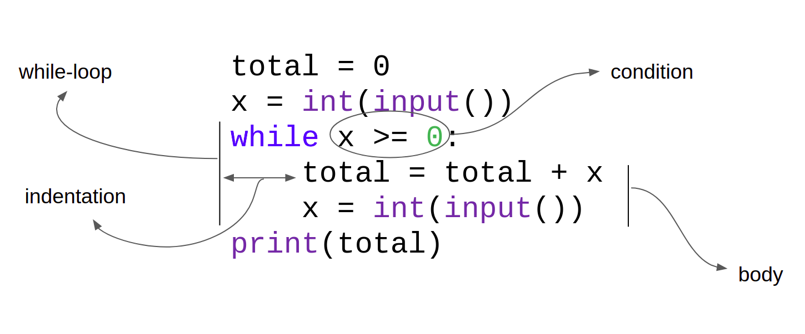

# Lesson-3.1

## Loops

### Introduction

Consider the following problem:

!!! question " " 
    Print the sum of the first five positive integers.

With our current knowledge of Python, how do we solve this?

```python
print(1 + 2 + 3 + 4 + 5)
```
Not a very elegant solution, but it gets the job done. Now, how about the following problem?

!!! question " " 
    Print the sum of the first 1,000,000 positive integers.

The earlier approach is not going to work. One million is just too big a number to count down to. Let's take a diversion and instead ponder: If it takes about five seconds on average to write a number followed by the `#!py +` symbol, how much time will it take to find the sum of all 1 million numbers? Let's find an answer using python:

<!-- Add a tooltip here -->

```python linenums="1"
num = 1_000_000		# _ in a number is used when we have large numbers; improves readability
avg_time = 5
seconds = num * avg_time
minutes = seconds / 60
hours = minutes / 60
days = hours / 24
print('Approximate number of days =', round(days))
```

It will take nearly 58 days to sum all 1 million integers! This is assuming that we work like machines that don't need food or sleep. All of this just to do something as trivial as finding the sum of numbers. This is where loops come in.


### `#!py while`

`#!py while` is a keyword in Python. The expression adjacent to `#!py while` is a boolean expression, called the **while condition**, or just the **condition**.
The *loopy* solution to the problem:

```python linenums="1"
total = 0
num = 0
while num < 1_000_000:
    num = num + 1
    total = total + num
print(total)
# Rest of code will follow below this comment
```

There's a lot to unpack here. Lines 4 and 5 make up the body of while. If the condition evaluates to `True`, control enters the body of while. The lines in the body are sequentially executed. After the last line in the body is executed, the control loops back to line 3, where the condition is evaluated again. As long as the condition is `True`, the body of while keeps getting executed. The moment the condition becomes `False`, the body of the while is skipped and control transfers to line 6. The body of the while loop must always be indented; this helps to separate it from the rest of the code.

A visual representation is given below:


Let us consider another example:

!!! question " "
    Keep accepting integers as input from the user until the user enters a negative number. Print the sum of the positive numbers entered by the user. Print 0 if the user doesn't enter any positive integer.

The visual representation of the code is given below:




One final example before closing this section:

!!! question " " 
    Keep accepting integers as input from the user until the user enters a negative number. Print the maximum among the positive numbers entered by the user. Print 0 if the user doesn't enter any positive integer.

**Solution**

```python linenums="1"
# Initialize
num = int(input())
max_num = 0
# Loop
while num >= 0:
    if num > max_num:
        max_num = num
    num = int(input())
# Print output
print(max_num)
```

Note that lines 6-8 make up the body of `#!py while` and are indented. Lines 1, 4 and 9 have some comments which are meant to help the reader understand what is happening in the code that follows them.


<!-- Might want to move this topic to after for loops -->

### Loop Control Statements

`#!py break` and `#!py continue` are keywords in Python and are associated with loops. The `#!py break` statement is used to exit out of a loop without executing any code that comes below it. For example:

```python linenums="1"
num = 1
while True:
	if (num % 2 == 0) and (num % 3 == 0) and (num % 4 == 0):
        break
	num = num + 1
print(num)
```

The above code prints the smallest positive integer that is divisible by 2, 3 and 4, which is the same as the LCM of $(2, 3, 4)$. The moment this number is found, the code breaks out of the loop.

The `#!py continue` statement is used to move to the next iteration of the loop, skipping whatever code comes below it. For example:

```python linenums="1"
x = 0
while x < 50:
    x = x + 1
    if x % 3 != 0:
        continue
    print(x)
```

The code given above prints all positive integers less than or equal to 50 that are divisible by 3. Whenever `x` is not divisible by 3, we do not want to print the number, so we continue to the next iteration.

The similarity between `#!py break` and `#!py continue` is that whenever either statement is encountered in a loop, all the statements that follow it are skipped. The main difference is that, `#!py break` exits the loop whereas `#!py continue` moves to the next iteration. 

`#!py break` and `#!py continue` are interesting features offered by Python. However, it is important to note that both the examples that we just discussed can be written without using `#!py break` or `#!py continue`. It is left as an exercise for the reader to figure out how this can be done.


