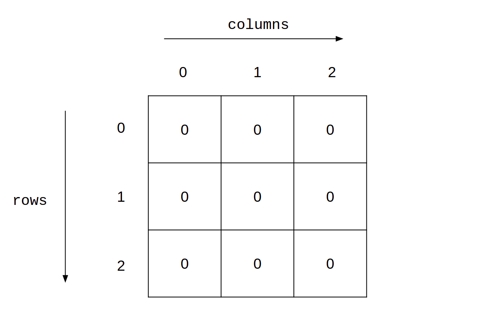

# Lesson-5.5

## Lists

### Nested Lists

Recall the `runs` list that we generated with the help of the `random` library:

```python
import random
runs = random.choices([0, 1, 2, 3, 4, 5, 6], 
                      weights = [30, 30, 20, 5, 10, 0, 5], 
                      k = 120)
assert len(runs) == 120
```

An `assert` statement is used whenever we wish to verify if some aspect of our code is working as intended. For example, in line-5 of the code given above, we are making sure that the length of the list is `120`. This is a useful check to have as subsequent computation will depend upon this. If the conditional expression following the `assert` keyword is `True`, then control transfers to the next line. If it is `False`, the interpreter raises an `AssertionError`.

Let us look at a different way of organizing the information contained in `runs`:

```python
overs = list()
new_over = list()
for ball, run in enumerate(runs):
    new_over.append(run)
    if (ball + 1) % 6 == 0:
        overs.append(new_over)
        new_over = list()
```

`overs` is a nested list, which is nothing but a list of lists. Each element in `overs` corresponds to an over in the match and is represented by a list that contains the runs scored in that over. The following code does a quick check if the sizes of the outer and inner lists are 20 and 6 respectively.

```python
assert len(overs) == 20
for over in overs:
    assert len(over) == 6
```

With this representation in place, how many runs were scored in the fourth ball of the third over?

```python
answer = overs[2][3]	# zero-indexing
print(answer)
```

The first index corresponds to the outer list while the second index corresponds to the inner list. If this is still confusing, print the following code to convince yourself:

```python
third_over = overs[2]
print(third_over)
fourth_ball = third_over[3]
print(fourth_ball)
assert fourth_ball == overs[2][3]
```


### Matrices

Matrices are 2D objects. We can represent them as nested lists. Let us first populate a $3 \times 3$ matrix of zeros:



```python
mat = [ ]
for i in range(3):
    mat.append([ ]) 	# we are appending an empty list
    for _ in range(3):
        mat[i].append(0)
print(mat)
```

This gives the following output:

```
[[0, 0, 0], [0, 0, 0], [0, 0, 0]]
```

Do you find anything odd in line-4? We have used `_` as a loop variable. The inner-loop variable is insignificant and never gets used anywhere. As a convention, we use the `_` to represent such variables whose sole purpose is to uphold the syntax of the language. Let us now construct another matrix:

```python
mat = [ ]
num = 1
for i in range(3):
    mat.append([ ])
    for _ in range(3):
        mat[i].append(num)
        num += 1
print(mat)
```

This gives the following output:

```
[[1, 2, 3], [4, 5, 6], [7, 8, 9]]
```

The code given above to construct this matrix could be written in the following manner as well:

```python
mat = [ ]
num = 1
for _ in range(3):
	row = [ ]
    for _ in range(3):
        row.append(num)
        num += 1
    mat.append(row)
print(mat)
```


### Shallow and Deep Copy

Consider the following code:

```python
mat1 = [[1, 2], [3, 4]]
mat2 = mat1
mat2.append([5, 6])
print(mat1)
print(mat2)
print(mat1 is mat2)
```

We already know what will happen here. Lists are mutable. `mat2` is just an alias for `mat1` and both point to the same object. Modifying any one of them will modify both. We also saw three different methods to copy lists so that modifying one doesn't modify the other. Let us try one of them:

```python
mat2 = mat1.copy()
mat2.append([5, 6])
print(mat1)
print(mat2)
print(mat1 is mat2)
```

No problems so far. But try this:

```python
mat1 = [[1, 2], [3, 4]]
mat2 = mat1.copy()
mat2[0][0] = 100
print(mat1)
print(mat2)
```

This is the output we get:

```
[[100, 2], [3, 4]]
[[100, 2], [3, 4]]
```

What is happening here? `mat1` has also changed! Wasn't `copy` supposed to get rid of this difficulty? We have a mutable object inside another mutable object. In such a case `copy` just does a shallow copy; only a new outer-list object is produced. This means that the inner lists in `mat1` and `mat2` are still the same objects:

```python
print(mat1[0] is mat2[0])
print(mat1[1] is mat2[1])
```

Both lines print `True`. In order to make a copy where both the inner and outer lists are new objects, we turn to deepcopy:

```python
from copy import deepcopy
mat1 = [[1, 2], [3, 4]]
mat2 = deepcopy(mat1)
mat2[0][0] = 100
print(mat1)
print(mat2)
```

This gives the output:

```
[[1, 2], [3, 4]]
[[100, 2], [3, 4]]
```

Finally we have two completely different objects:

```python
from copy import deepcopy
mat1 = [[1, 2], [3, 4]]
mat2 = deepcopy(mat1)
print(mat1 is not mat2)
print(mat1[0] is not mat2[0])
print(mat1[1] is not mat2[1])
```

All three print `True`! `deepcopy` is a function from the library `copy`. We won't enter into how it works. Suffice to say that when using nested lists or any collection of mutable objects, use `deepcopy` if you wish to make a clean copy.

